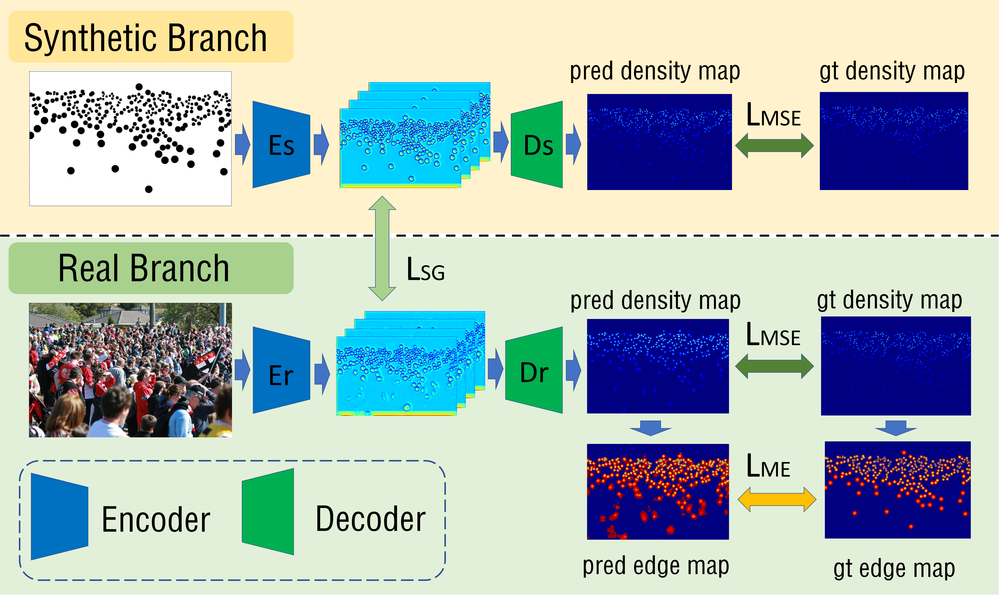
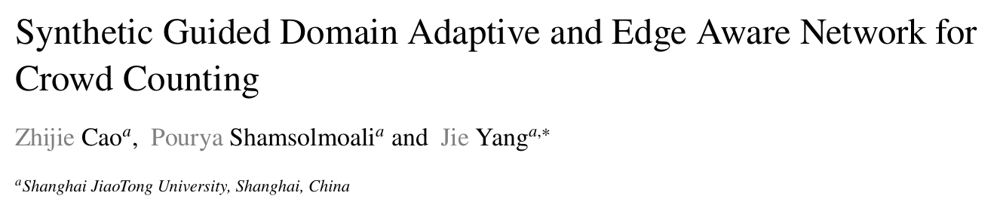

# SGDANet

### 1.Introduction
Official Implement for the Journal paper《Synthetic Guided Domain Adaptive and Edge Aware 
Network for Crowd Counting》<br> 
The journal is《Image and Vision Computing》. 
In this project, you train a CSRNet or our SGEANet on ShanghaiTech dataset.




### 2.Project Organization
The folders are organized as follows:
* data: dataset processing code, image list file, the soft link of dataset folders.
* experiment: config file for training, testing.
* images: images to show on this readme.md
* main: two main scripts, train.py and val.py.
* src: all other codes 

### 3.Requirement
* pytorch=1.1.0
* torchvision
* progressbar
* visdom

### 4.Tutorial
#### (1) prepare dataset
* Download ShanghaiTech dataset from [Shanghaitech](https://xxxxx.com)
* Create soft link to the data folder in this project
```shell script
ln -s to/path/ShanghaiTech_PartA data/SHA
```
* Generate synthetic data, density map ground truth, save gt number and make a image list file in json format.
```python
python data/prepare_dataset/SHA/make_ga_synthetic.py
python data/prepare_dataset/SHA/make_ga_gt.py
python data/prepare_dataset/SHA/save_gt_num.py
python data/prepare_dataset/SHA/make_json.py
```
#### (2) training real and synthetic baseline model
```shell script
sh train.sh experiment/SHA/SGEANet/syn_baseline.yaml
sh train.sh experiment/SHA/SGEANet/real_baseline.yaml
```
#### (3) training SGEANet
```shell script
sh train.sh experiment/SHA/SGEANet/real_baseline_LSG_LME.yaml
```
#### (4) evaluating
```shell script
sh val.sh experiment/SHA/SGEANet/syn_baseline.yaml
sh val.sh experiment/SHA/SGEANet/real_baseline.yaml
sh val.sh experiment/SHA/SGEANet/real_baseline_LSG_LME.yaml
```
Bellow is a demo of predicted density maps from different methods.


### 5.Citation
If you use this code for your research, please cite our paper:



